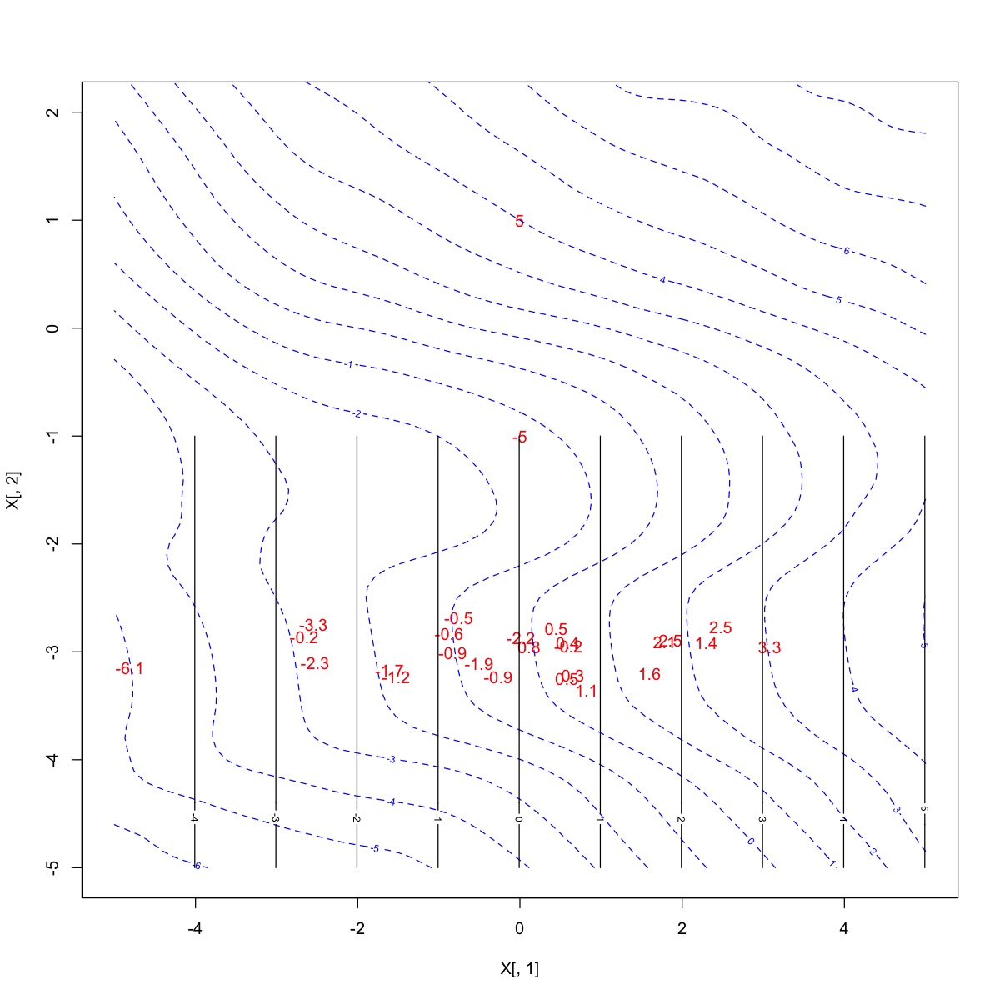

# Inappropriate prior-likelihood domination prevents reasonable prediction

## 1/7/18 Summary:

I don't think these test cases are successful. Moving to:  `Work 7-17 to 11-25.ipynb`. (actually was the same as this)

Note: as the results and code in this file are the same as both:

* Work 7-17.ipynb
* Work 7-17 to 11-25.ipynb

I deleted both of those notebooks.

The successful code is in one of the .Rmd files, I believe, in this directory.

## New work:
`Work 7-17 no 3.ipynb` is from August 2020 and uses the functions in `kmixfun_v35.R`,
`mpdpm.c` and `dpmg2.c` from `testing1711/zzz_code`.


### Abstract
When a group of (x,y)-points gets its own input covariance prior (as one of the matrices of the covariance prior mixture) that gives much higher likelihoods than the other possible (x,y)-point combinations, that particular group arrangement of (x,y)-points will be too strong in the posterior.
The problem occurs when predicting points nearby that would naturally be in that group but whose position has an
unreasonable low probability in the posterior.

This problem typically occurs in two situations:

1. high $p$, such all data set sizes appear small
* realistic situations when a few points are isolated from the others and will encourage separation during clustering


```R
#lapply(c('mclust', 'mvtnorm', 'plotrix'), function(x) library(x))
sessionInfo()
```


    R version 3.6.3 (2020-02-29)
    Platform: x86_64-apple-darwin15.6.0 (64-bit)
    Running under: macOS Mojave 10.14.6
    
    Matrix products: default
    BLAS:   /Library/Frameworks/R.framework/Versions/3.6/Resources/lib/libRblas.0.dylib
    LAPACK: /Library/Frameworks/R.framework/Versions/3.6/Resources/lib/libRlapack.dylib
    
    locale:
    [1] en_US.UTF-8/en_US.UTF-8/en_US.UTF-8/C/en_US.UTF-8/en_US.UTF-8
    
    attached base packages:
    [1] stats     graphics  grDevices utils     datasets  methods   base     
    
    other attached packages:
    [1] MASS_7.3-51.5 plotrix_3.7-8 mvtnorm_1.1-1 mclust_5.4.6 
    
    loaded via a namespace (and not attached):
     [1] Rcpp_1.0.4.6    digest_0.6.25   crayon_1.3.4    IRdisplay_0.7.0
     [5] repr_1.1.0      jsonlite_1.6.1  evaluate_0.14   pillar_1.4.3   
     [9] rlang_0.4.5     uuid_0.1-4      vctrs_0.2.4     IRkernel_1.1   
    [13] tools_3.6.3     compiler_3.6.3  base64enc_0.1-3 htmltools_0.4.0
    [17] pbdZMQ_0.3-3   


```R
install.packages('mclust')
install.packages('plotrix')
install.packages('mvtnorm')
```

    
    The downloaded binary packages are in
    	/var/folders/b3/f3v0bf156kb_q_bl2lmmpy2r0000gn/T//RtmppHscNk/downloaded_packages
    
    The downloaded binary packages are in
    	/var/folders/b3/f3v0bf156kb_q_bl2lmmpy2r0000gn/T//RtmppHscNk/downloaded_packages
    
    The downloaded binary packages are in
    	/var/folders/b3/f3v0bf156kb_q_bl2lmmpy2r0000gn/T//RtmppHscNk/downloaded_packages


```R
library(mclust)
library(mvtnorm)
library(plotrix)
```

    Package 'mclust' version 5.4.6
    Type 'citation("mclust")' for citing this R package in publications.
    
    
    Attaching package: ‘mvtnorm’
    
    
    The following object is masked from ‘package:mclust’:
    
        dmvnorm
    
    


```R
setwd("~/Dropbox/MPDPM data and results/sim_repository/functions/testing_1711")
runcode = "/Users/clanker/Dropbox/MPDPM data and results/sim_repository/functions/code"
source(paste(runcode, "/../final_1706/kmixfun_v35.R", sep=""))
```


```R
# Functions
plotsize <- function(wd,ht){options(repr.plot.width=wd, repr.plot.height=ht)}
# based on ~/Dropbox/Rmodels/mvn_plots.R
out2dplots <- function(train, out, delay=1){
  N=1000
  x3 = c(seq(1,0,length=N/4)^.333,rep(0,3*N/4))
  x2 = c(seq(0,1,length=N/4)^.667,rep(1,N/4),seq(1,0,length=N/2))
  x1 = c(rep(0,N/4),sqrt(seq(0,1,length=N/4)),rep(1,N/2))
  nclust = max(out$index)+1
  maxmem2=nrow(train)
  for (i in 1:nrow(out$index)){
    plot(train[,2], train[,1], xlim=c(-8,8), ylim=c(-8,8))
    #main=paste("sample #", i))
    for (j in 1:nclust){
      mem = sum(out$index[i,] == j-1)
      nc2 = round(N*(j-0.5)/nclust)
      col = rgb(x1[nc2],x2[nc2],x3[nc2])
      if (mem == 0)
        col = 'grey70'
      meanvect = out$mu[i,c(1,2),j]
      sigmat <- diag(dim(out$mu)[2])
      sigmat[upper.tri(sigmat, diag=TRUE)] <- as.double(out$sigma[i,,j])
      sigmat <- sigmat + t(sigmat) - diag(diag(sigmat))
      ellipse.ci(meanvect, sigmat[1:2,1:2], p=.9, col=col, lwd=0.5+sqrt(mem))
      isx = which(out$index[i,] == j-1)
      if (length(isx) > 0){
        points(train[isx,2], train[isx,1], cex=.75, col=col, pch=16)
      }
    }
    Sys.sleep(delay)
  }
}
library(plotrix)
## The following didn't work ...
ellipse.ci <- function(dat, mat, p, col=2, lwd=2){
  g=svd(mat)
  d=atan(g$u[2,1]/g$u[2,2])*180/pi
  q=qnorm(1-(1-p)/2)
  draw.ellipse(dat[2],dat[1],
               q*sqrt(pi/2*g$d[2]),q*sqrt(pi/2*g$d[1]),
               angle=d, border=col, lwd=lwd)
}
## ... and is replaced by this function:
ellipse.ci <- function(dat, mat, p, col=2, lwd=2){
	g=svd(mat)
	d=atan(g$u[2, 1] / g$u[1, 1])*180/pi
	q=qnorm(1-(1-p)/2)
	draw.ellipse(dat[1], dat[2],
		q*sqrt(pi/2*g$d[1]), q*sqrt(pi/2*g$d[2]),
		angle=d, border=col, lwd=lwd)
}

```

## Testcase 1.

Define a testcase of a circle of points with two points at $(\pm1, 0)$. 


### Strategy for this testcase:

1. run MPDPM as is (poor results)
2. but... if you provide middle points in a $S_l$, you get strong results (regression surface too sharp)
3. solution: adding a 1/2 point smoother term for all $S_l$ smoothes the regression surface
  


```R
# Testcase: Circle testcase (X1 = data) 
rx = seq(pi/12,2*pi,pi/6)
X1 = cbind(5*sin(rx),5*cos(rx),0)
X1 = rbind(X1, c(1,0,5), c(-1,0,-5))  
# W1 = test mesh
xs = seq(-6,6,len = 20*6+1); L = length(xs)
W1 = cbind(rep(xs,L),rep(xs,each=L),0)
# compute E[Y|X] for T1 = truth, an oracle function
T1 = rep(0, nrow(W1))
for (i in 1:nrow(W1)){
  d = sqrt(colSums((t(X1[,-3])-W1[i,-3])^2))
  temp = dnorm(d, 0, sd = 1)
  T1[i] = weighted.mean(X1[,3], w=temp)  
}
# inject noise here
set.seed(0); X1[,3] = X1[,3] + rnorm(nrow(X1),0,0.1) # first try
train = X1
nclust = 10
```


```R
# First run. (With mclust, will skip this in future)
outcov <- run.mclust_v3(X1, sampsize=nrow(X1), seedno=NULL, cmax=8, cmin=1, printlevel=0, noIflag=T)
S1 = outcov$mat
wl1 = rep(1, dim(S1)[3])
obs1 = round(outcov$obs,2)
obs1[obs1 == 1] = 0
```


```R
get.rmse <- function(y, yhat, X, xs){
  sst = sum((y-mean(y))^2)
  sse = sum((y-yhat)^2)
  v1 = floor(min(y)); v2 = ceiling(max(y))
  contour(xs,xs,matrix(y,L,L),levels = seq(v1,v2,len=v2-v1+1))
  text(X[,1],X[,2],round(X[,3],1),col='red')
  v1 = floor(min(yhat)); v2 = ceiling(max(yhat))
  contour(xs,xs,matrix(yhat,L,L),levels = seq(v1,v2,len=v2-v1+1),col='blue',lty=2,add = T)
  return(list(rmse=sqrt(sum((y-yhat)^2)/length(y)), r2=1-sse/sst))
}
```


```R
# note obs=obs*10000
outB1 <- MPDPM(X1, S1, obs=obs1*10000, wl1, n=nclust, Burn=100, J=200, Thin=10, rho=NULL, 
             a=1, b=1, seed="patrick", iterprint=1000, printlevel=0, 
             so.dir=runcode, so.file=NULL, Xtest=W1, yind=3, out.type=4)

plotsize(10, 10)
get.rmse(y = T1, yhat = outB1, X1, xs)
```


<dl>
	<dt>$rmse</dt>
		<dd>1.04543760900256</dd>
	<dt>$r2</dt>
		<dd>0.436423634881257</dd>
</dl>


### Aside
Looks good, but that's because Mclust performs well when the dimension is low. 
Mclust will get into problems with the dimension is large, the number of observations
is very large, and some clusters contain few points (due to the ease that clusters
of points are highly separated in high dimensions). Clusters with few points
will have S_l that are strongly influential for Gibbs sampler components that
contain the same points.

But a handcrafted S_l collection includes the middle two points,
yielding poor results (too strong of S_l matches a component's covariance):


```R
# Handpicked cov S_l
S2 = array(0, c(3,3,8))
S2[,,1] = cov(X1)
for (i in 2:7){ S2[,,i] = cov(X1[i:(i+2),])}
S2[,,8] = cov(X1[13:14,]) + 5e-5*diag(3)
obs2 = c(14, rep(3, 6), 2)
wl2 = rep(1, dim(S2)[3])
```


```R
# note obs=obs*1000
outB2 <- MPDPM(X1, S2, obs=obs2*10000, wl2, n=nclust, Burn=100, J=200, Thin=10, rho=NULL, 
             a=1, b=1, seed="patrick", iterprint=1000, printlevel=0, 
             so.dir=runcode, so.file=NULL, Xtest=W1, yind=3, out.type=4)

plotsize(10, 10)
get.rmse(y = T1, yhat = outB2, X1, xs)
```


<dl>
	<dt>$rmse</dt>
		<dd>1.49352037529427</dd>
	<dt>$r2</dt>
		<dd>-0.150214494972947</dd>
</dl>


The input S_l for the middle two points strongly influences the prediction values
along $y=0$.

The same problem will occur if we add a cluster of those two middle points to the
first model:


```R
k = dim(S1)[3]
S3 = array(0, c(3,3,k+1))
S3[,,1:k] = S1
S3[,,k+1] = cov(X1[13:14,]) + 5e-5*diag(3)
obs3 = c(obs1, 2)
wl3 = rep(1, dim(S3)[3])
det(S3[,,k+1])
```


1.278638426533e-07


```R
# new S_l inputs with added middle points cov.
# note: obs*10000 still (essentially no S_l smoothing with empirical cov. Gamma)
outB3 <- MPDPM(X1, S3, obs=obs3*10000, wl3, n=nclust, Burn=100, J=200, Thin=10, rho=NULL, 
              a=1, b=1, seed="patrick", iterprint=1000, printlevel=0, 
              so.dir=runcode, so.file=NULL, W1, yind=3, out.type=4)

plotsize(10, 10)
get.rmse(y = T1, yhat = outB3, X1, xs)
```


<dl>
	<dt>$rmse</dt>
		<dd>1.49413699334395</dd>
	<dt>$r2</dt>
		<dd>-0.151164451117028</dd>
</dl>


### but S_l smoothing helps all three of these cases (now without obs multiplier)


```R
outB1S <- MPDPM(X1, S1, obs1*20, wl1, n=nclust, Burn=100, J=200, Thin=10, rho=NULL, 
              a=1, b=1, seed="patrick", iterprint=1000, printlevel=0, 
              so.dir=runcode, so.file=NULL, W1, yind=3, out.type=4)
# This is too much smoothing of cluster-algorithm provided covariance matrices for this example...

plotsize(10, 10)
get.rmse(y = T1, yhat = outB1S, X1, xs)
```


<dl>
	<dt>$rmse</dt>
		<dd>1.1272664224936</dd>
	<dt>$r2</dt>
		<dd>0.344746009274458</dd>
</dl>


```R
outB2S <- MPDPM(X1, S2, obs2*20, wl2, n=nclust, Burn=100, J=200, Thin=10, rho=NULL, 
              a=1, b=1, seed="patrick", iterprint=1000, printlevel=0, 
              so.dir=runcode, so.file=NULL, W1, yind=3, out.type=4)

plotsize(10, 10)
get.rmse(y = T1, yhat = outB2S, X1, xs)
```


<dl>
	<dt>$rmse</dt>
		<dd>0.990106330685723</dd>
	<dt>$r2</dt>
		<dd>0.494501108742638</dd>
</dl>


```R
outB3S <- MPDPM(X1, S3, obs3*20, wl3, n=nclust, Burn=100, J=200, Thin=10, rho=NULL, 
              a=1, b=1, seed="patrick", iterprint=1000, printlevel=0, 
              so.dir=runcode, so.file=NULL, W1, yind=3, out.type=4)

plotsize(10, 10)
get.rmse(y = T1, yhat = outB3S, X1, xs)
```


<dl>
	<dt>$rmse</dt>
		<dd>1.08373282361679</dd>
	<dt>$r2</dt>
		<dd>0.394378914656345</dd>
</dl>


## Testcase 2.

Define a testcase of twelve points and analyze subsequent predicted values
(smoothed values) in the region. 

- Group 1 will be the ten points between $(\pm3, -3)$ and $(\pm0.01, \mp0.01)$.
- Two other points are near $(0, 2)$.
- The point we are most concerned about predicting is $(0, 0)$.
- The expected value of all points is zero in this region.
- The problem of extreme concentrated prediction contours here is due to the nature of the specific prediction task:
    - We require a very large number of latent components because the response
    surface is very wiggly and complicated
    - The dimensionality of the test case is large so points are usually far apart
    - Though this scenario seems improbable in 2-dim, it may occur often in much high
    dimensions.

### Strategy for this testcase:

1. run MPDPM as is, providing logical $S_l$ of size 3.
2. solution: adding some of $\Gamma$ (empirical covariance) into 
all $S_l$ smoothes the regression surface
   
This testcase doesn't involve a strongly define response surface as in Testcase 2.


```R
# Testcase: seven points testcase (X1 = data, response is column 3) 
p = 25
X1 = array(0, c(p+2, 3))
set.seed(0)
X1[1:p, 1:2] = mvrnorm(p, c(0, -3), matrix(c(4, 0, 0, 0.04), 2, 2))
X1[1:p, 3] = X1[1:p, 1] + rnorm(p, 0, 1)
X1[(p+1):(p+2), 2] = c(-1, 1)
X1[(p+1):(p+2), 3] = c(-5, 5)
```


```R
X1[1:5, ]
```


<table>
<caption>A matrix: 5 × 3 of type dbl</caption>
<tbody>
	<tr><td>-2.5259086</td><td>-3.100722</td><td>-2.2597712</td></tr>
	<tr><td> 0.6524667</td><td>-3.217154</td><td> 0.2757640</td></tr>
	<tr><td>-2.6595985</td><td>-2.861809</td><td>-0.2182339</td></tr>
	<tr><td>-2.5448586</td><td>-2.743080</td><td>-3.3401978</td></tr>
	<tr><td>-0.8292829</td><td>-3.009345</td><td>-0.8841603</td></tr>
</tbody>
</table>


```R
# W1 = test mesh
xs = seq(-5, 5, len = 10*10+1); L = length(xs)
W1 = cbind(rep(xs,L),rep(xs,each=L),0)
# compute E[Y|X] for T1 = truth, an oracle function
#T1 = rep(0, nrow(W1))
# NEW IDEA 8/2020:
T1 = W1[, 1]
#for (i in 1:nrow(W1)){
#  d = sqrt(colSums((t(X1[,-3])-W1[i,-3])^2))
#  temp = dnorm(d, 0, sd = 1)
#  T1[i] = weighted.mean(X1[,3], w=temp)  
#}
```


```R
# I don't want to rely on mclust anymore, so I'm not using this line:
#outcov <- run.mclust_v3(X1, sampsize=nrow(X1), seedno=NULL, cmax=3, cmin=1, printlevel=0, noIflag=T)
# instead I'll make my own input covariance matrices according to:
S = array(0, dim=c(3,3,3))
wl = rep(1, 3)
```


```R
S[,,1] = cov(X1)
S[,,2] = cov(X1[1:p,])
S[,,3] = cov(X1[(p+1):(p+2),])
```


```R
## add some to diagonal to prevent singularities (and crashing)
for (i in 1:3) {S[,,i] = S[,,i] + 2.5e-2*diag(3); cat(det(S[,,i]), ' ')}

#Displaying the determinants:
#0.4830842  0.0008920859  2.3201e-08

# NEW IDEA 8/2020:
# add some to diagonal to prevent singularities (and crashing)
#for (i in 1:3) {
#    if (i > 1) S[,,i] = 0.99*S[,,i] + 0.01*S[,,1]
#    cat(det(S[,,i]), ' ')
#}
# Displaying the determinants:
#0.4824627  0.001478807  0.001137945
```

    6.059097  0.1648525  0.03251563  


```R
get.rmse <- function(y, yhat, X, xs, W1){
  isx <- (W1[, 2] <= -1)
  sst = sum((y[isx]-mean(y[isx]))^2)
  sse = sum((y[isx]-yhat[isx])^2)
  v1 = floor(min(y)); v2 = ceiling(max(y))
  v1 = floor(min(yhat)); v2 = ceiling(max(yhat))
  plot(X[, 1], X[, 2], type='n', ylim=c(-5, 2), xlim=c(-5, 5))
  text(X[,1],X[,2],round(X[,3],1),col='red')
  contour(xs,xs,matrix(yhat,L,L),levels = seq(v1,v2,len=v2-v1+1),col='blue',lty=2,add = T)
  contour(xs, xs[xs <= -1], matrix(y[isx], length(xs), length(xs[xs <= -1])),
          levels = seq(v1,v2,len=v2-v1+1), col=1,add = T)
  return(list(rmse=sqrt(sum((y[isx]-yhat[isx])^2)/length(y[isx])), r2=1-sse/sst))
}
```


```R
# 1. Run as is.
nclust = 5
obs = c(1, 1, 1)*1e4   # a large 'obs' weights Gamma (empirical cov.) very little
    # so there isn't much smoothing of the S_l inputs.
outA1 <- MPDPM(X1, S, obs=obs, wl, n=nclust, Burn=100, J=200, Thin=10, rho=NULL, 
               a=1, b=1, seed="patrick", iterprint=1000, printlevel=0, 
               so.dir=runcode, so.file=NULL, Xtest=W1, yind=3, out.type=4)

plotsize(10, 10)
get.rmse(y = T1, yhat = outA1, X1, xs, W1)
# NOTE 8/2020: changed R2/SSE calculation to consider only y values <= -1 (where most points are)
```


<dl>
	<dt>$rmse</dt>
		<dd>2.78203154441897</dd>
	<dt>$r2</dt>
		<dd>0.0894471159832712</dd>
</dl>


```R
# now smooth the S_l covariance inputs with Gamma (empirical cov.)
# according to the number of points in S_l (the vector 'obs')
nclust = 5
obs = c(27, 25, 2)
outA2 <- MPDPM(X1, S, obs=obs, wl, n=nclust, Burn=100, J=200, Thin=10, rho=NULL, 
               a=1, b=1, seed="patrick", iterprint=1000, printlevel=0, 
               so.dir=runcode, so.file=NULL, Xtest=W1, yind=3, out.type=4)

plotsize(10, 10)
get.rmse(y = T1, yhat = outA2, X1, xs, W1)
# NOTE 8/2020: changed R2/SSE calculation to consider only y values <= -1 (where most points are)
```


<dl>
	<dt>$rmse</dt>
		<dd>1.43338531246451</dd>
	<dt>$r2</dt>
		<dd>0.758283123060121</dd>
</dl>





```R
MPDPM
```


<pre class=language-r><code>function (X, S, obs, wl, n = NULL, Burn = 500, J = 250, Thin = 2, 
<span style=white-space:pre-wrap>    rho = NULL, a = 1, b = 1, seed = "patrick", iterprint = 1000, </span>
<span style=white-space:pre-wrap>    printlevel = 1, so.dir = NULL, so.file = NULL, Xtest, yind, </span>
<span style=white-space:pre-wrap>    out.type = 4) </span>
{
<span style=white-space:pre-wrap>    if (!(out.type %in% 1:4)) </span>
<span style=white-space:pre-wrap>        stop("Error: out.type must be in 1:4")</span>
<span style=white-space:pre-wrap>    if (is.null(n)) </span>
<span style=white-space:pre-wrap>        n &lt;- ncol(X) * 2</span>
<span style=white-space:pre-wrap>    if (is.null(rho)) </span>
<span style=white-space:pre-wrap>        rho &lt;- ncol(X) + 2</span>
<span style=white-space:pre-wrap>    if (is.null(so.dir)) </span>
<span style=white-space:pre-wrap>        so.dir &lt;- paste(getwd(), "/code", sep = "")</span>
<span style=white-space:pre-wrap>    if (so.dir == "pwd") </span>
<span style=white-space:pre-wrap>        so.dir &lt;- getwd()</span>
<span style=white-space:pre-wrap>    if (substr(so.dir, nchar(so.dir), nchar(so.dir)) != "/") </span>
<span style=white-space:pre-wrap>        so.dir &lt;- paste(so.dir, "/", sep = "")</span>
<span style=white-space:pre-wrap>    if (is.null(so.file)) </span>
<span style=white-space:pre-wrap>        so.file &lt;- "mpdpm.so"</span>
<span style=white-space:pre-wrap>    if (is.null(dim(Xtest))) </span>
<span style=white-space:pre-wrap>        Xtest &lt;- matrix(Xtest, ncol = 1)</span>
<span style=white-space:pre-wrap>    N &lt;- nrow(X)</span>
<span style=white-space:pre-wrap>    k &lt;- ncol(X)</span>
<span style=white-space:pre-wrap>    L &lt;- dim(S)[3]</span>
<span style=white-space:pre-wrap>    Xm &lt;- as.matrix(X)</span>
<span style=white-space:pre-wrap>    G &lt;- (t(Xm) %*% Xm) * (nrow(X)^(-9/7))</span>
<span style=white-space:pre-wrap>    for (l in 1:L) {</span>
<span style=white-space:pre-wrap>        if (obs[l] &gt; 1) {</span>
<span style=white-space:pre-wrap>            S[, , l] &lt;- (1/obs[l]) * ((obs[l] - 1) * S[, , l] + </span>
<span style=white-space:pre-wrap>                G)</span>
<span style=white-space:pre-wrap>        }</span>
<span style=white-space:pre-wrap>        else {</span>
<span style=white-space:pre-wrap>            S[, , l] &lt;- G</span>
<span style=white-space:pre-wrap>        }</span>
<span style=white-space:pre-wrap>    }</span>
<span style=white-space:pre-wrap>    Smat &lt;- matrix(NA, k * (k + 1)/2 + 1, L)</span>
<span style=white-space:pre-wrap>    for (i in 1:k) for (j in 1:i) Smat[sum(1:i) - i + j, ] &lt;- S[i, </span>
<span style=white-space:pre-wrap>        j, ]</span>
<span style=white-space:pre-wrap>    Smat[k * (k + 1)/2 + 1, ] &lt;- wl</span>
<span style=white-space:pre-wrap>    dyn.load(paste(so.dir, so.file, sep = ""))</span>
<span style=white-space:pre-wrap>    out &lt;- .C("mpdpm", as.integer(c(N, k, n, rho, L, Burn, Thin, </span>
<span style=white-space:pre-wrap>        J, iterprint, printlevel)), as.double(c(a, b)), as.double(stack(as.data.frame(t(X)))$values), </span>
<span style=white-space:pre-wrap>        as.double(stack(as.data.frame(Smat))$values), ind = integer(N * </span>
<span style=white-space:pre-wrap>            J), phi = double((n - 1) * J), mu = double(n * k * </span>
<span style=white-space:pre-wrap>            J), sigma = double(n * k * (k + 1)/2 * J), as.character(seed))</span>
<span style=white-space:pre-wrap>    dyn.unload(paste(so.dir, so.file, sep = ""))</span>
<span style=white-space:pre-wrap>    phimat &lt;- matrix(out$phi, J, n - 1, byrow = T)</span>
<span style=white-space:pre-wrap>    muvect &lt;- matrix(out$mu, J, n * k, byrow = T)</span>
<span style=white-space:pre-wrap>    sigmawidth &lt;- k * (k + 1)/2</span>
<span style=white-space:pre-wrap>    sigmavect &lt;- matrix(out$sigma, J, n * sigmawidth, byrow = T)</span>
<span style=white-space:pre-wrap>    mumat &lt;- array(NA, dim = c(J, k, n))</span>
<span style=white-space:pre-wrap>    sigmamat &lt;- array(NA, dim = c(J, sigmawidth, n))</span>
<span style=white-space:pre-wrap>    for (i in 1:n) {</span>
<span style=white-space:pre-wrap>        mumat[, , i] &lt;- muvect[, 1:k + (i - 1) * k]</span>
<span style=white-space:pre-wrap>        sigmamat[, , i] &lt;- sigmavect[, 1:sigmawidth + (i - 1) * </span>
<span style=white-space:pre-wrap>            sigmawidth]</span>
<span style=white-space:pre-wrap>    }</span>
<span style=white-space:pre-wrap>    if (out.type == 1) {</span>
<span style=white-space:pre-wrap>        indmat &lt;- matrix(out$ind, J, N, byrow = T)</span>
<span style=white-space:pre-wrap>        return(list(index = indmat, phi = phimat, mu = mumat, </span>
<span style=white-space:pre-wrap>            sigma = sigmamat))</span>
<span style=white-space:pre-wrap>    }</span>
<span style=white-space:pre-wrap>    if (out.type &gt; 1) {</span>
<span style=white-space:pre-wrap>        J &lt;- dim(mumat)[1]</span>
<span style=white-space:pre-wrap>        d &lt;- dim(mumat)[2]</span>
<span style=white-space:pre-wrap>        n &lt;- dim(mumat)[3]</span>
<span style=white-space:pre-wrap>        parmat &lt;- array(NA, dim = c(1 + d + d^2, n, J))</span>
<span style=white-space:pre-wrap>        pmat &lt;- phi2p.fun(phimat)</span>
<span style=white-space:pre-wrap>        parmat[1, , ] &lt;- t(pmat)</span>
<span style=white-space:pre-wrap>        parmat[1 + 1:d, , ] &lt;- sapply(1:J, function(i) {</span>
<span style=white-space:pre-wrap>            mumat[i, , ]</span>
<span style=white-space:pre-wrap>        })</span>
<span style=white-space:pre-wrap>        sm &lt;- diag(d)</span>
<span style=white-space:pre-wrap>        sm[upper.tri(sm, diag = TRUE)] &lt;- 1:(d * (d + 1)/2)</span>
<span style=white-space:pre-wrap>        sm[sm == 0] &lt;- t(sm)[sm == 0]</span>
<span style=white-space:pre-wrap>        parmat[-(1:(d + 1)), , ] &lt;- sapply(1:J, function(i) {</span>
<span style=white-space:pre-wrap>            sapply(1:n, function(k) {</span>
<span style=white-space:pre-wrap>                (sigmamat[i, , k])</span>
<span style=white-space:pre-wrap>            })[as.double(sm), ]</span>
<span style=white-space:pre-wrap>        })</span>
<span style=white-space:pre-wrap>    }</span>
<span style=white-space:pre-wrap>    if (out.type == 2) </span>
<span style=white-space:pre-wrap>        return(parmat)</span>
<span style=white-space:pre-wrap>    if (out.type &gt; 2) {</span>
<span style=white-space:pre-wrap>        pred &lt;- matrix(NA, nrow(Xtest), J)</span>
<span style=white-space:pre-wrap>        if (printlevel &gt; 1) </span>
<span style=white-space:pre-wrap>            cat("Making predictions ")</span>
<span style=white-space:pre-wrap>        SN &lt;- ceiling(nrow(Xtest)/5000)</span>
<span style=white-space:pre-wrap>        for (segno in 1:SN) {</span>
<span style=white-space:pre-wrap>            seg &lt;- seq(ceiling((segno - 1) * nrow(Xtest)/SN + </span>
<span style=white-space:pre-wrap>                1e-09), segno * nrow(Xtest)/SN, by = 1)</span>
<span style=white-space:pre-wrap>            pred[seg, ] &lt;- getpred.fun(parmat, mat = Xtest[seg, </span>
<span style=white-space:pre-wrap>                ], d = d, n = n, yind = yind)</span>
<span style=white-space:pre-wrap>            if (printlevel &gt; 1 &amp; segno != SN) </span>
<span style=white-space:pre-wrap>                cat("* ")</span>
<span style=white-space:pre-wrap>        }</span>
<span style=white-space:pre-wrap>        if (printlevel &gt; 1) </span>
<span style=white-space:pre-wrap>            cat("\n")</span>
<span style=white-space:pre-wrap>    }</span>
<span style=white-space:pre-wrap>    if (out.type == 3) </span>
<span style=white-space:pre-wrap>        return(pred)</span>
<span style=white-space:pre-wrap>    if (out.type == 4) </span>
<span style=white-space:pre-wrap>        return(rowMeans(pred))</span>
}</code></pre>


The reason for this problem is the following:
When the new mean is computed in the Gibbs sampler, the steps are:

* The posterior distribution for $\mu_m$ (for component $m$) is a mixture of $N$ multivariate normal density kernels (given $N$ cases)
* We must select a kernel from this MVN mixture, amounting to selecting the $z_i$ that gets computed in the MVN density formula (each MVN kernel differs only by the case $z_i$)
* A new mean parameter $\mu_m$ is drawn from the selected MVN kernel; though the density will be dominated by its covariance matrix $\Sigma_m^{-1}$, the presence of $\Gamma^{-1}$ will still make deviations from the high-density region of the MVN with $\Sigma_m$ covariance possible (though not every sampler iteration, but often enough)
* This $\Gamma$ check on the dominance of $\Sigma_m$ is important in being able to explore the posterior, and this provides a reason why $\Gamma$ should not be too broad (or else $\Gamma^{-1}$ becomes relatively insignificant).

A similar check on the dominance in the covariance draw in the Gibbs sampler does not exist, the sampler steps being:

* The posterior distribution for $\Sigma_m^{-1}$ is an $L$-element mixture of Wishart densities, 
where $S_l, l=1, ..., L$ are the user-provided covariance matrices. 
* The mixture is of Wisharts with $n_m + \rho$ degrees of freedom and scale matrix $(S_l + {SS}_m)^{-1}$,
where ${SS}_m$ is the empirical covariance of all cases assigned to component $m$.
* We must select a kernel (based on the $S_l$) to determine the Wishart distribution for the Gibbs draw.
* If a cluster is strongly elliptical, ${SS}_m$ will sharply cut into the $X$-space around $\mu_m$. If ${SS}_m$ ever approximately equals the $S_l$ associated with those same cases (both in cluster $m$ and the computation for $S_l$) then the posterior draw is from a distribution approximately Wishart$(\tfrac 1 2 {SS}_m^{-1})$.
* The resulting $\Sigma_m$ will be approximately $2\, {SS}_m$ which is unlikely to attract any other cases to join cluster component $m$, ensuring this process will repeat for all iterations.
* This instability points out the valid criticism of our chosen empirical approach. The proposed broading of the input $S_l$ prior covariance matrices that correct this instability also goes away from the pure data-driven model, possibly addressing some of this criticism.


To do:

2. Demonstrate with circle testcase:
    * Probability of sliver cluster of nearby points to all clusters, 
maybe a heat map of lowest probability of being in the sliver cluster for grid of points, for 500 iterations.
    * Show how means move around for the 5 or 10 clusters.
3. Does this cause a problem with California housing predictions? Run a 60/40 split and save all output for select iterates. See which test cases have highest prediction variation. Compare residuals with kNN predictions?
